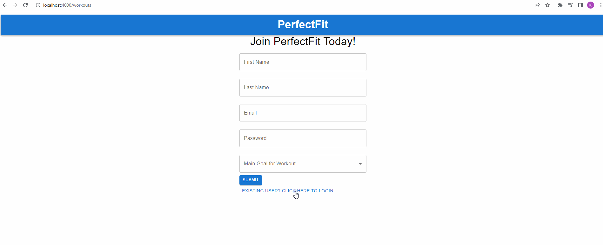

# PerfectFit

Thank you and Welcome to PerfectFit! Start your fitness journey with this application designed to help you improve your physical health. Schedule a workout session with our trainers with varying areas of expertise. View and manage your routines, and create exercises that cater to your goals. 

# Front-end installations

From the main project page (https://github.com/klums24/p5-final-project), you can clone the repository

After opening the project, navigate to the /client path

You will need to install the following dependencies by running "npm install" + the following:

```
        @emotion/react
        @emotion/styled
        @mui/material
        formik
        yup
        react-bootstrap
        react-chat-engine
        react-router-dom
        react-scripts
        styled-components
        

```

# Run React server

While still in the /client directory, run "npm start" to start the front-end server

# Features

## Signup 


## Logging in


## Logging out


## View trainers


## Schedule workout with a trainer


## Cancel a scheduled workout


## Create exercise


## Create routine


## Edit profile


## Chat


## Delete account
